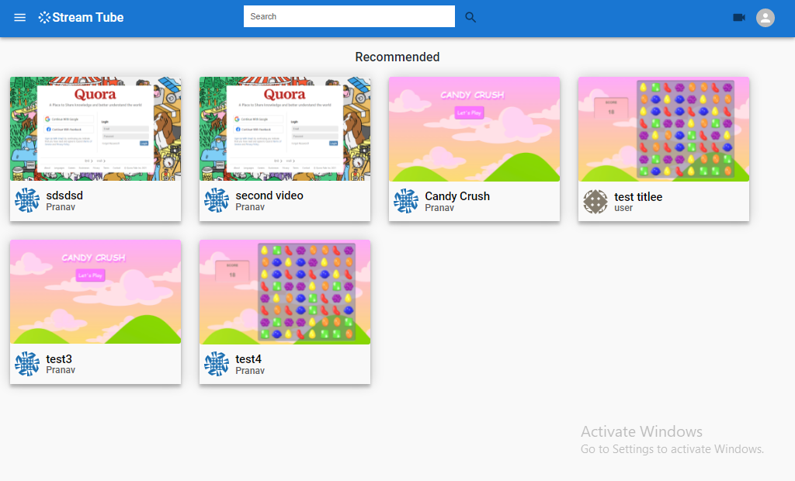

# fullstack-video-streaming-app

# Tech Stack
1. React Js
2. Express Js
3. MongoDB
4. Firebase
5. Json Web Tokens
6. MUI

# Features
1. Authentication using JWT
2. Video Upload (storage is done in firebase)
3. Like and dislike system
4. Subscription system
5. View Videos
6. Search videos (still basic)
